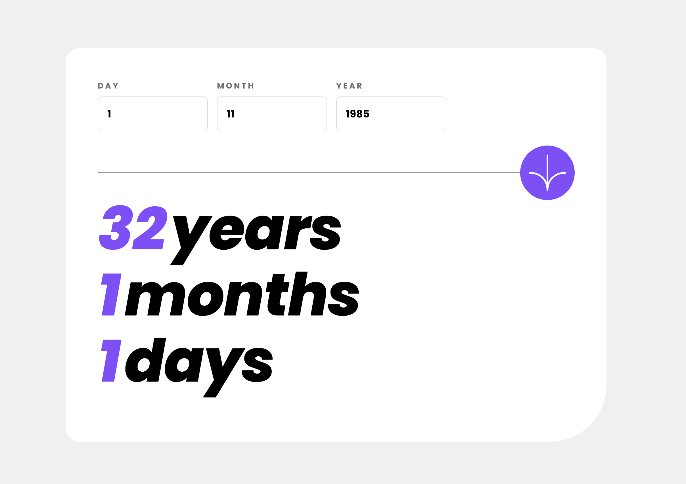
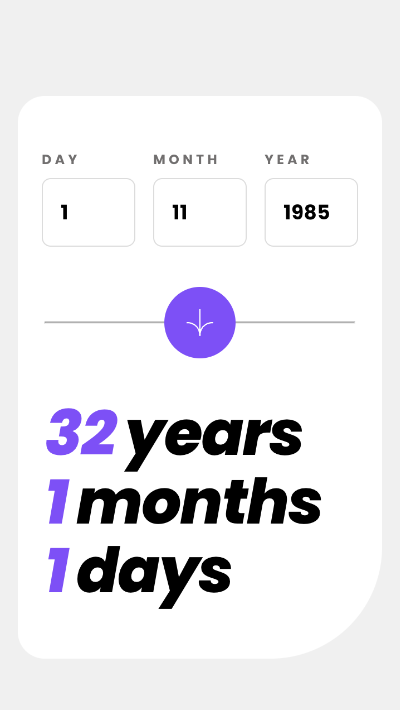

# Age calculator app
This app calculates and displays a person's age in years, months, and days instantly as the user enters their date of birth, with real-time error validation and a user-friendly interface

Experimenting with Vue. Deviated a bit from the input form, added input handlers so the user doesn't have to submit the form every time the user wants to experiment with various ages. This app only works with AD years.

Note that it doesn't work with year 0 as there technically isn't a year 0 (went from 1 bc to 1 ad). 

## Table of contents

- [Overview](#overview)
  - [The challenge](#the-challenge)
  - [Screenshot](#screenshot)
  - [Links](#links)
- [Built with](#built-with)
- [Local Development](#local-development)
- [Author](#author)

## Overview

### The challenge
Users should be able to: 

- View an age in years, months, and days after submitting a valid date through the form
- Receive validation errors if:
  - Any field is empty when the form is submitted
  - The day number is not between 1-31
  - The month number is not between 1-12
  - The year is in the future
  - The date is invalid e.g. 31/04/1991 (there are 30 days in April)
- View the optimal layout for the interface depending on their device's screen size
- See hover and focus states for all interactive elements on the page

### Screenshot

#### Desktop

#### Mobile

### Links

- [Github](https://github.com/MaxAnderberg/age-calculator)
- [Deployed age calculator](https://velvety-figolla-e1a441.netlify.app/)

## Built with

- Flexbox
- Mobile-first workflow
- Vue

## Local Development

To set up the project locally, follow these steps:

1. Clone the project: `git clone https://github.com/MaxAnderberg/age-calculator`
2. Navigate into the project directory: `cd age-calculator`
3. Install dependencies: `npm install`
4. Start the development server: `npm run serve`

## Author
- Website - [Max Anderberg](www.github.com/maxanderberg)
